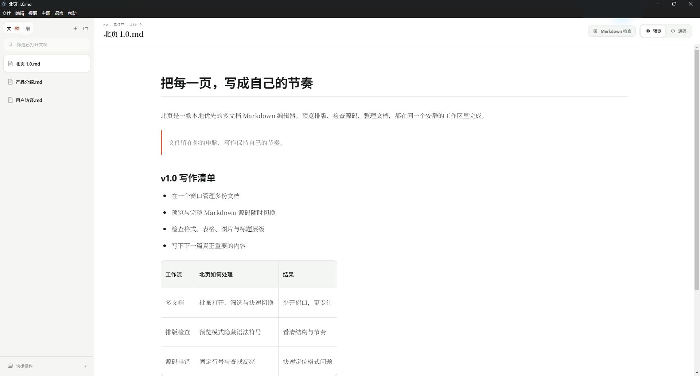

<div align="center">
  
  <h1>BeiyeMD · 北页</h1>
  <p><strong>Write locally. See the structure. Keep the source honest.</strong></p>
  <p>A calm, local-first Markdown workspace for people who work across more than one document.</p>
  <p><strong>English</strong> · <a href="README_CN.md">简体中文</a></p>
  <p>
    
    
    
    
    
    
    
  </p>
</div>



<p align="center">
  <a href="https://github.com/chenzhiyong1994/BeiyeMD/releases/latest"><strong>Download BeiyeMD 1.0.0 for Windows</strong></a>
  ·
  <a href="#run-from-source">Run from source</a>
</p>

BeiyeMD keeps Preview, raw Markdown, and multi-document navigation in one window. It works directly with ordinary files, so your notes remain portable and external tools—including AI coding agents—can participate without an import, export, or proprietary database.

## Version 1.0.0

This is the first stable BeiyeMD release for everyday writing. The multi-document workspace, Preview and Source modes, Markdown checks, resizable tables, and portable image workflow now form one coherent experience. The Windows installer, SHA-256 checksum, and full notes are available from [GitHub Releases](https://github.com/chenzhiyong1994/BeiyeMD/releases/tag/v1.0.0).

- **Start with a file** — no account, migration, or proprietary library.
- **Review layout and syntax** — Preview reveals the reading experience; Source adds fixed line numbers and search highlighting.
- **Stay in one workspace** — batch open, switch, search across documents, and receive live external updates.

## Why BeiyeMD

| Principle | What it means in practice |
| --- | --- |
| **Files stay yours** | Local Markdown files are the source of truth. There are no accounts, cloud lock-in, or hidden document databases. |
| **Preview and source are peers** | Write in a clean rendered view, then switch to line-numbered Markdown when syntax needs inspection. |
| **One window, many documents** | Open, filter, rename, search, and switch files without turning every note into another app window. |
| **Friendly to external tools** | File changes made by another editor or an AI workflow are reflected live. |
| **Useful editing, restrained UI** | Table and image tools appear only when their content is selected; the rest of the workspace stays quiet. |

## Highlights

- Multi-select Open, drag-and-drop, recent documents, `Ctrl/Cmd + P` Quick Open, and cross-document content search.
- Resizable document sidebar with compact `Doc / TOC` states, heading outline, filename ellipsis, and close controls only when they are useful.
- Preview-first editing plus complete Markdown source, soft wrapping, fixed line numbers, visible word count, and in-place file rename.
- Find and Replace with visible hit highlighting, active-result navigation, case, whole-word, regular-expression, replace-one, and replace-all controls.
- Markdown quality checks for heading jumps, duplicate headings, unclosed fences, uneven tables, trailing whitespace, unmatched emphasis, and missing local images.
- Persistent drag-to-resize table columns, plus row/column movement, alignment, equal-width, and content-fit actions.
- Pasted and dropped images keep their natural pixel size, save beside the document in `assets/`, use portable relative links, and support drag resizing and left/center/right alignment.
- GFM, task lists, `==highlight==`, localized LaTeX formula insertion, PDF export, and live external-file refresh.
- Five coordinated themes: Light, Dark, Mist, Sage, and Graphite. Light is true white; Dark is true black.
- Simplified Chinese by default, with complete English and Traditional Chinese UI translations.
- Built-in release notes and the Markdown handbook open as read-only references and close without save prompts.

## Predictable window behavior

| Entry point | New | Open |
| --- | --- | --- |
| Application **File** menu | Creates a new window | Multi-selects files into a new window |
| Sidebar actions | Adds an untitled document here | Multi-selects files into this window |

This distinction stays consistent: a document close button closes a document, while the system window control closes the window.

## Keyboard map

| Action | Shortcut |
| --- | --- |
| Quick Open | `Ctrl/Cmd + P` |
| Find and Replace | `Ctrl/Cmd + F` |
| Save | `Ctrl/Cmd + S` |
| Insert formula | `Ctrl/Cmd + Shift + E` |
| Toggle document sidebar | `Ctrl/Cmd + Shift + B` |

The same shortcuts are discoverable from the footer of the document sidebar.

## Download

Windows x64 users can download `BeiyeMD.Setup.1.0.0.exe` from [GitHub Releases](https://github.com/chenzhiyong1994/BeiyeMD/releases/latest). The community build is not code-signed yet, so Windows SmartScreen may ask for confirmation; release notes include the SHA-256 checksum for verification.

## Run from source

Node.js 20 or later is required.

```bash
git clone https://github.com/chenzhiyong1994/BeiyeMD.git
cd BeiyeMD
npm ci
npm run dev
```

Build the production app or create a package for the current platform:

```bash
npm run build
npm run dist
```

## Validation

```bash
npm run check:workspace-ui
npm test
npm run legal:notices
npx tsc -p tsconfig.main.json --noEmit
npx tsc -p tsconfig.preload.json --noEmit
npx tsc -p tsconfig.renderer.json --noEmit
npm run build
```

## Project scope

BeiyeMD is intentionally a local desktop editor. Accounts, cloud sync, collaborative editing, knowledge-base databases, slide tooling, and hidden version history are out of scope. The goal is to make file-based Markdown work exceptionally well.

## Contributing

Issues and focused pull requests are welcome. Please describe the user workflow being improved, keep platform behavior consistent, and run the validation commands above before submitting a change.

## License and acknowledgements

BeiyeMD itself is available under the [MIT License](LICENSE). License texts for independent open-source components such as Milkdown, Electron, and KaTeX are generated from the locked dependency tree in [THIRD_PARTY_NOTICES.txt](THIRD_PARTY_NOTICES.txt). Electron's bundled Chromium / Node notices are preserved in [ELECTRON_THIRD_PARTY_NOTICES.html](ELECTRON_THIRD_PARTY_NOTICES.html); both files ship with application packages.
